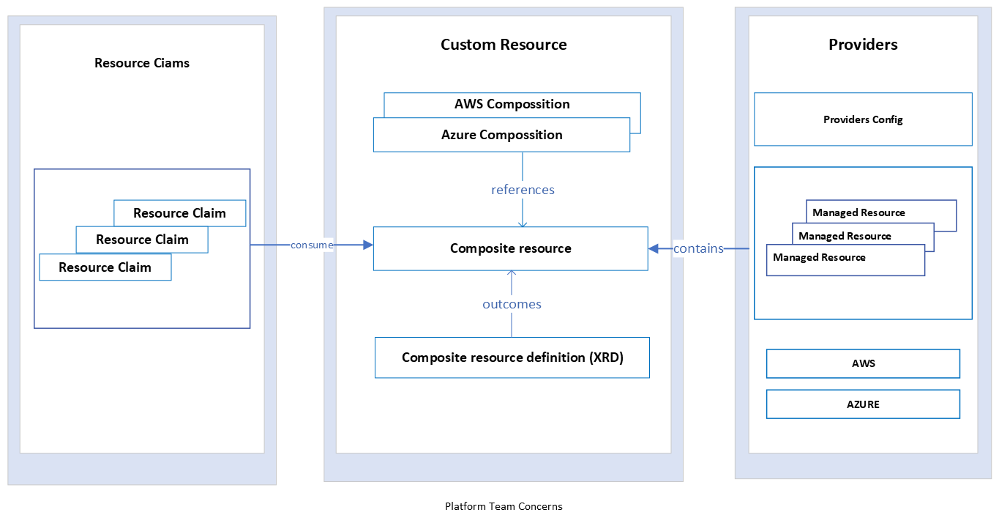

   
   ## UCP Architecture Understanding
   UCP, which stands for Unified Control Plane, serves as the central hub for managing and orchestrating an enterprise's service deployment. Within this control plane, essential tasks include establishing configuration baselines, provisioning user and role access, and hosting applications to enable their seamless execution alongside associated services.

   The same framework can also be employed to deploy infrastructure using Crossplane.

   **What is Crossplane?**
   Crossplane is an open source control plane framework supported by the cloud-native community.
   Crossplane has been endorsed by some of the world's best companies and is released under the Apache 2.0 license. 

   More details refer to the [Crossplane](https://www.crossplane.io/ "Crossplane Official website")

   **Why opt for Crossplane when constructing control planes?**

   **Declarative Configuration**: Crossplane facilitates the creation of control planes with Kubernetes-style declarative and API-driven configuration and management for various resources. This approach ensures that applications and infrastructure managed within your control plane possess inherent self-healing capabilities.

   **Unified Configuration**: Crossplane enables the convergence of application and infrastructure configurations within the same control plane. This simplifies your toolchains and deployment pipelines, reducing complexity.

   **Single Source of Truth**: Control planes constructed using Crossplane seamlessly integrate with CI/CD pipelines. This enables teams to produce, monitor, and approve changes while adhering to GitOps best practices with help of pull base CD tool like Flux and ArgoCD .

   **Automation through Reconciliation**: Your control planes comprise multiple controllers, each responsible for managing the complete lifecycle of a cloud and on-prem resource. These controllers handle provisioning, health monitoring, scaling, failover, and real-time response to external deviations from the desired configuration.

   **High Extensibility**: Crossplane-based control planes leverage well-established Kubernetes design and patterns, making them effortlessly extendable by incorporating custom APIs and controllers. This enhances flexibility and security by embedding policies, quotas, and permissions into custom definitions.

   **Clear Separation of Concerns**: Crossplane allows for the incorporation of organizational concepts and policies at the API level. This grants customers the freedom to self-service within the predefined boundaries of the control plane APIs.

   In summary, Crossplane bridges the gap between open-source capabilities and enterprise-grade control plane needs."

   **UCP** is structured into distinct layers:

   > **Layer 1 - Kubernetes Runtime**:Handles critical functions such as event monitoring, reconciliation, management of Custom Resource Definitions (CRDs), OpenAPI, data persistence (etcd), Ingress handling, RBAC enforcement, and workload execution.

   > **Layer 2 - Crossplane Runtime**:Manages interactions with external APIs, encompassing resource creation, updates, and deletions.
   
   > **Layer 3 - Providers**:Establishes connections with cloud APIs to enable the provisioning and management of cloud resources.
   
   > **Layer 4 - Configurations**:Composes customized domain-specific APIs, empowering the management of resources and configurations with fine-grained control.

   **UCP** Leverages **ArgoCD** to continuously observe changes in the infrastructure and assists in seamlessly syncing these changes back to a Git repository.

  Here, the visual representation of **UCP**

  <picture>
      <source media="(prefers-color-scheme: light)" srcset="../images/UCP Architecture Understanding.png">
      
  </picture> 
  
  **Platform Team in UCP**
  The platform team is responsible for developing and managing the Composite ResourcDefinition(XRD) and compositions of managed resources to meet enterprise security and other governance requirements.
  
  <picture>
      <source media="(prefers-color-scheme: light)" srcset="../images/comositeresourcedefinition.png">
      
  </picture> 

  **Azure Provider Configration**

  ```
  apiVersion: azure.upbound.io/v1beta1
  kind: ProviderConfig
  metadata:
    name: azure
    namespace: crossplane-system
    annotations:
      provider.platform.volvocars.com/external-name: azure-provider
    labels:
      environment:  development
      provider: azure
  spec:
    credentials:
      source: Secret
      secretRef:
        namespace: crossplane-system
        name: azure-secret
        key: creds
  ```
  **Managed Resources**

  **Composition**

  ```
  apiVersion: apiextensions.crossplane.io/v1
  kind: Composition
  metadata:
    name: xpostgres-composition-ref
    namespace: ucplearn
    labels:
      provider: azure
      guide: ucplearn
  spec:
    writeConnectionSecretsToNamespace: crossplane-system
    #The compositeTypeRef gives this Composition an apiVersion and kind to reference in another Composition
    #A Composition’s compositeTypeRef defines which Composite Resource type can use this Composition.
    compositeTypeRef:
      apiVersion: database.platform.volvocars.com/v1alpha1
      kind: XCompositePostgreSQLInstance
    patchSets:
    - name: metadata
      patches:
      - fromFieldPath: metadata.labels 
    #The resources field of a Composition’s spec defines the set of things that a Composite Resource creates. 
    resources:
      # resource group with other resource live in  
      - name: rg-ucp-learn
        base: 
          apiVersion: azure.upbound.io/v1beta1
          kind: ResourceGroup
          spec:
            forProvider:
              location: West Europe
              tags:
                provisioner: crossplane-composition
                application: ucplearn
      # db-server
      - name: postgresqlserver
        # The contents of the base are identical to creating a standalone managed resource.
        base:
          apiVersion: database.azure.crossplane.io/v1beta1
          kind: PostgreSQLServer
          spec:
            forProvider:
              createMode: Default
              administratorLogin: ucplearnadmin
              # Matching a controller reference ensures that the matching resource is in the same composite resource
              # Matching only a controller reference simplifies the matching process without requiring labels or more information.
              resourceGroupNameRef: rg-ucp-learn
              minimalTlsVersion: TLS1_2
              sslEnforcement: Enabled
              sku:
                tier: GeneralPurpose
                capacity: 2
                family: Gen5  
              storageProfile:
                backupRetentionDays: 35
                geoRedundantBackup: Disabled
                storageAutogrow: Disabled
            writeConnectionSecretToRef:
              namespace: crossplane-system
            providerConfigRef:
              name: azure
        # Some Compositions have resources which need identical patches applied. 
        # Instead of repeating the same patches field, resources can reference a single patchSet.
        patches:
        - type: PatchSet
          patchSetName: Metadata
        - fromFieldPath: "metadata.uid"
          toFieldPath: "spec.writeConnectionSecretToRef.name"
          transforms:
          - type: string
            string:
              fmt: "postgresqlserver-admin-%s"
        - fromFieldPath: "spec.parameters.version"
          toFieldPath: "spec.forProvider.version"
        - fromFieldPath: "spec.parameters.location"
          toFieldPath: "spec.forProvider.location"
        - fromFieldPath: "spec.parameters.dbName"
          toFieldPath: "spec.forProvider.dbName"
        - fromFieldPath: "spec.parameters.storageGB"
          toFieldPath: "spec.forProvider.storageProfile.storageMB"
          transforms:
            - type: math
              math:
                multiply: 1024
    ```
    **Composite Resource Definition(XRD)**

    ```
    apiVersion: apiextensions.crossplane.io/v1
    kind: CompositeResourceDefinition
    metadata:
      name: xcompositepostgresqlinstance
      namespace: ucplearn
    spec:
      connectionSecretKeys:
      - username
      - password
      - jdbcendpoint
      - host
      - port
      - database
      group: database.platform.volvocars.com
      defaultCompositionRef:
        name: xpostgres-composition-ref
      names:
        kind: XCompositePostgreSQLInstance
        plural: xcompositepostgresqlinstances
      claimNames:
        kind: PostgreSQLInstance
        plural: postgresqlinstances
      versions:
      - name: v1alpha1
        served: true
        referenceable: true
        schema:
          openAPIV3Schema:
            type: object
            properties:
              spec:
                type: object
                properties:
                  parameters:
                    type: object
                    properties:
                      version:
                        description: PostgreSQL engine version
                        type: string
                        enum: ["11","12"]
                      storageGB:
                        type: integer
                      location:
                        description: Geographic location of this PostgreSQL server.
                        type: string
                      dbName:
                        description: The name of the database
                        type: string
                    required:
                    - version
                    - storageGB
                    - location
                    - dbName
                required:
                - parameters
      ```


    